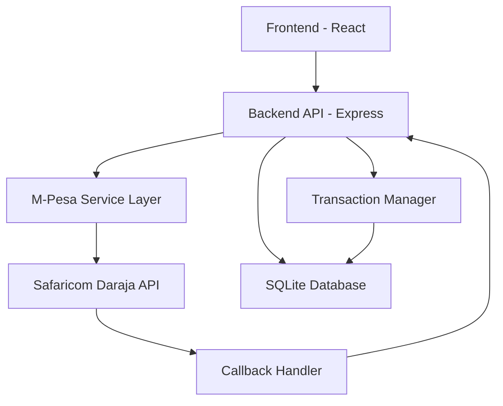
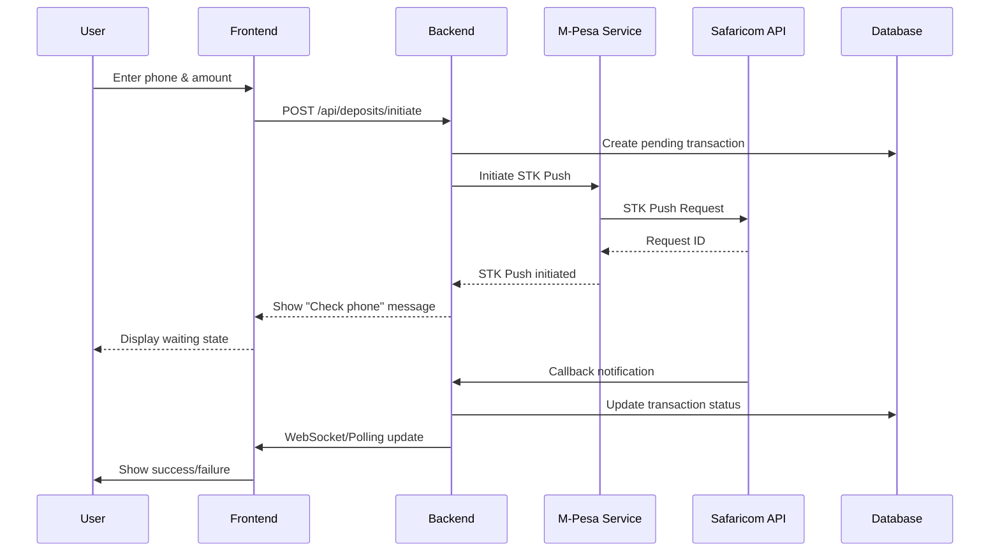

# M-Pesa STK Push Integration Design Document

## Overview

This design document outlines the implementation of M-Pesa STK Push integration for the WealthRise investment platform. The integration will enable users to deposit funds directly from their M-Pesa accounts using the Safaricom Daraja API. The solution follows a secure, scalable architecture that handles real-time payment processing, callback management, and transaction tracking.

## Architecture

### High-Level Architecture



### Component Interaction Flow



## Components and Interfaces

### 1. Frontend Components

#### DepositForm Component
- **Purpose**: Handles user input for phone number and deposit amount
- **Props**: `onSubmit`, `loading`, `error`
- **State**: `phoneNumber`, `amount`, `validationErrors`
- **Validation**: Phone number format, amount limits

#### DepositStatus Component
- **Purpose**: Shows real-time deposit status updates
- **Props**: `transactionId`, `status`, `onClose`
- **Features**: Auto-refresh, status icons, progress indicators

#### TransactionHistory Component
- **Purpose**: Displays user's deposit transaction history
- **Props**: `userId`, `filters`
- **Features**: Pagination, filtering, transaction details modal

### 2. Backend Services

#### MpesaService Class
```javascript
class MpesaService {
  async getAccessToken()
  async initiateSTKPush(phoneNumber, amount, accountReference, transactionDesc)
  async querySTKPushStatus(checkoutRequestId)
  validateCallback(callbackData)
}
```

#### TransactionService Class
```javascript
class TransactionService {
  async createTransaction(userId, phoneNumber, amount)
  async updateTransactionStatus(transactionId, status, mpesaReceiptNumber)
  async getTransactionHistory(userId, filters)
  async getTransactionById(transactionId)
}
```

#### CallbackHandler Class
```javascript
class CallbackHandler {
  async handleSTKCallback(callbackData)
  async validateCallbackSignature(data, signature)
  async processSuccessfulPayment(transactionData)
  async processFailedPayment(transactionData)
}
```

### 3. API Endpoints

#### Deposit Endpoints
- `POST /api/deposits/initiate` - Initiate STK Push
- `POST /api/deposits/callback` - Handle M-Pesa callbacks
- `GET /api/deposits/status/:transactionId` - Check transaction status
- `GET /api/deposits/history` - Get user's transaction history

#### Request/Response Schemas
```javascript
// Initiate Deposit Request
{
  phoneNumber: "254712345678",
  amount: 1000,
  description: "WealthRise Deposit"
}

// Initiate Deposit Response
{
  success: true,
  transactionId: "TXN_123456789",
  checkoutRequestId: "ws_CO_123456789",
  message: "STK Push sent. Check your phone."
}

// Callback Payload (from Safaricom)
{
  Body: {
    stkCallback: {
      MerchantRequestID: "29115-34620561-1",
      CheckoutRequestID: "ws_CO_191220191020363925",
      ResultCode: 0,
      ResultDesc: "The service request is processed successfully.",
      CallbackMetadata: {
        Item: [
          { Name: "Amount", Value: 1000 },
          { Name: "MpesaReceiptNumber", Value: "NLJ7RT61SV" },
          { Name: "TransactionDate", Value: 20191219102115 },
          { Name: "PhoneNumber", Value: 254712345678 }
        ]
      }
    }
  }
}
```

## Data Models

### Transaction Model
```sql
CREATE TABLE transactions (
  id INTEGER PRIMARY KEY AUTOINCREMENT,
  user_id INTEGER NOT NULL,
  transaction_id VARCHAR(50) UNIQUE NOT NULL,
  checkout_request_id VARCHAR(100),
  phone_number VARCHAR(15) NOT NULL,
  amount DECIMAL(10,2) NOT NULL,
  status ENUM('PENDING', 'COMPLETED', 'FAILED', 'EXPIRED') DEFAULT 'PENDING',
  mpesa_receipt_number VARCHAR(50),
  transaction_date DATETIME,
  created_at TIMESTAMP DEFAULT CURRENT_TIMESTAMP,
  updated_at TIMESTAMP DEFAULT CURRENT_TIMESTAMP ON UPDATE CURRENT_TIMESTAMP,
  FOREIGN KEY (user_id) REFERENCES users(id)
);
```

### User Balance Update
```sql
-- Add balance column to users table
ALTER TABLE users ADD COLUMN balance DECIMAL(10,2) DEFAULT 0.00;

-- Create balance_history table for audit trail
CREATE TABLE balance_history (
  id INTEGER PRIMARY KEY AUTOINCREMENT,
  user_id INTEGER NOT NULL,
  transaction_id VARCHAR(50) NOT NULL,
  amount DECIMAL(10,2) NOT NULL,
  balance_before DECIMAL(10,2) NOT NULL,
  balance_after DECIMAL(10,2) NOT NULL,
  transaction_type ENUM('DEPOSIT', 'WITHDRAWAL', 'INVESTMENT') NOT NULL,
  created_at TIMESTAMP DEFAULT CURRENT_TIMESTAMP,
  FOREIGN KEY (user_id) REFERENCES users(id)
);
```

### Configuration Model
```javascript
// Environment Configuration
const mpesaConfig = {
  environment: process.env.MPESA_ENVIRONMENT, // 'sandbox' or 'production'
  consumerKey: process.env.MPESA_CONSUMER_KEY,
  consumerSecret: process.env.MPESA_CONSUMER_SECRET,
  businessShortCode: process.env.MPESA_BUSINESS_SHORTCODE,
  passkey: process.env.MPESA_PASSKEY,
  callbackUrl: process.env.MPESA_CALLBACK_URL,
  baseUrl: process.env.MPESA_ENVIRONMENT === 'production' 
    ? 'https://api.safaricom.co.ke' 
    : 'https://sandbox.safaricom.co.ke'
};
```

## Error Handling

### Error Categories and Responses

#### 1. Validation Errors
```javascript
// Phone number validation
const phoneValidation = {
  pattern: /^(?:\+254|254|0)?([17]\d{8})$/,
  errorMessage: "Please enter a valid Kenyan phone number"
};

// Amount validation
const amountValidation = {
  min: 10,
  max: 150000,
  errorMessage: "Amount must be between KES 10 and KES 150,000"
};
```

#### 2. M-Pesa API Errors
```javascript
const mpesaErrorCodes = {
  '1': 'Insufficient funds in the account',
  '2': 'Less than minimum transaction value',
  '3': 'More than maximum transaction value',
  '4': 'Would exceed daily transfer limit',
  '5': 'Would exceed minimum balance',
  '6': 'Unresolved primary party',
  '17': 'Invalid KYC Details',
  '26': 'System internal error',
  '2001': 'Wrong PIN entered',
  '1032': 'Request cancelled by user'
};
```

#### 3. System Errors
```javascript
class MpesaError extends Error {
  constructor(message, code, statusCode = 500) {
    super(message);
    this.name = 'MpesaError';
    this.code = code;
    this.statusCode = statusCode;
  }
}

// Error handling middleware
const errorHandler = (error, req, res, next) => {
  if (error instanceof MpesaError) {
    return res.status(error.statusCode).json({
      success: false,
      error: error.message,
      code: error.code
    });
  }
  // Handle other errors...
};
```

## Testing Strategy

### 1. Unit Tests
- **MpesaService**: Test token generation, STK Push initiation, callback validation
- **TransactionService**: Test CRUD operations, status updates, balance calculations
- **Validation**: Test phone number and amount validation functions
- **Error Handling**: Test error scenarios and proper error responses

### 2. Integration Tests
- **API Endpoints**: Test complete deposit flow from initiation to callback
- **Database Operations**: Test transaction creation and updates
- **M-Pesa Sandbox**: Test with Safaricom sandbox environment

### 3. End-to-End Tests
- **User Journey**: Test complete user deposit flow in browser
- **Callback Handling**: Test callback processing with mock M-Pesa responses
- **Error Scenarios**: Test user experience during various error conditions

### 4. Security Tests
- **Callback Validation**: Test callback signature verification
- **Input Sanitization**: Test SQL injection and XSS prevention
- **Rate Limiting**: Test API rate limiting and abuse prevention

### Test Data Setup
```javascript
// Sandbox test credentials (Safaricom provided)
const testCredentials = {
  consumerKey: "your_sandbox_consumer_key",
  consumerSecret: "your_sandbox_consumer_secret",
  businessShortCode: "174379",
  passkey: "bfb279f9aa9bdbcf158e97dd71a467cd2e0c893059b10f78e6b72ada1ed2c919",
  testPhoneNumber: "254708374149" // Safaricom test number
};

// Test scenarios
const testScenarios = [
  { amount: 1, expectedResult: "success" },
  { amount: 10, expectedResult: "success" },
  { amount: 100000, expectedResult: "success" },
  { phoneNumber: "254700000000", expectedResult: "user_cancelled" },
  { phoneNumber: "254711111111", expectedResult: "insufficient_funds" }
];
```

## Security Considerations

### 1. API Security
- Store M-Pesa credentials in environment variables
- Use HTTPS for all API communications
- Implement request signing for callback validation
- Rate limiting on deposit endpoints

### 2. Data Protection
- Encrypt sensitive transaction data at rest
- Mask phone numbers in logs (show only last 4 digits)
- Implement proper session management
- Use parameterized queries to prevent SQL injection

### 3. Callback Security
```javascript
// Callback URL validation
const validateCallback = (req) => {
  const signature = req.headers['x-mpesa-signature'];
  const payload = JSON.stringify(req.body);
  const expectedSignature = crypto
    .createHmac('sha256', process.env.MPESA_CALLBACK_SECRET)
    .update(payload)
    .digest('base64');
  
  return signature === expectedSignature;
};
```

### 4. Transaction Security
- Implement idempotency for transaction creation
- Use database transactions for balance updates
- Implement transaction timeouts (5 minutes)
- Log all transaction state changes for audit

## Performance Considerations

### 1. Database Optimization
- Index on transaction_id and checkout_request_id
- Index on user_id for transaction history queries
- Implement pagination for transaction history
- Archive old transactions periodically

### 2. API Performance
- Cache M-Pesa access tokens (expires in 1 hour)
- Implement connection pooling for database
- Use async/await for non-blocking operations
- Implement proper timeout handling

### 3. Real-time Updates
```javascript
// WebSocket implementation for real-time status updates
const io = require('socket.io')(server);

io.on('connection', (socket) => {
  socket.on('subscribe_transaction', (transactionId) => {
    socket.join(`transaction_${transactionId}`);
  });
});

// Emit updates when transaction status changes
const notifyTransactionUpdate = (transactionId, status) => {
  io.to(`transaction_${transactionId}`).emit('transaction_update', {
    transactionId,
    status,
    timestamp: new Date()
  });
};
```

## Deployment Configuration

### Environment Variables
```bash
# M-Pesa Configuration
MPESA_ENVIRONMENT=sandbox
MPESA_CONSUMER_KEY=your_consumer_key
MPESA_CONSUMER_SECRET=your_consumer_secret
MPESA_BUSINESS_SHORTCODE=174379
MPESA_PASSKEY=your_passkey
MPESA_CALLBACK_URL=https://yourdomain.com/api/deposits/callback
MPESA_CALLBACK_SECRET=your_callback_secret

# Database
DATABASE_URL=sqlite:./database.sqlite

# Application
JWT_SECRET=your_jwt_secret
PORT=5000
NODE_ENV=production
```

### Production Considerations
- Use production M-Pesa credentials
- Implement proper logging and monitoring
- Set up SSL certificates for HTTPS
- Configure reverse proxy (nginx) for load balancing
- Implement health checks for M-Pesa service availability